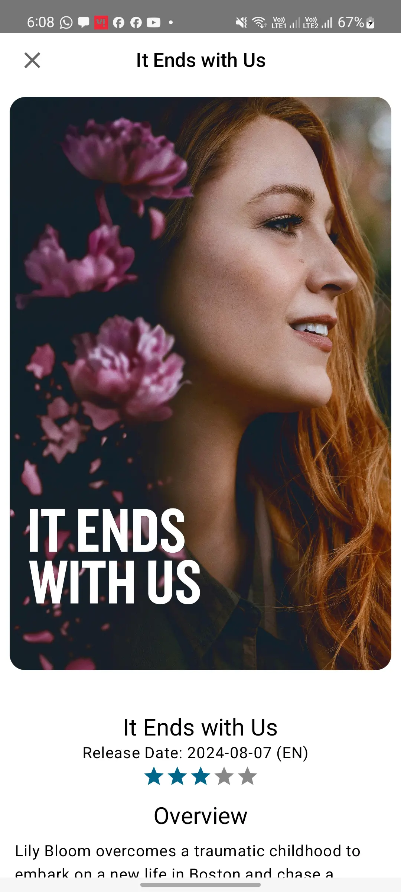
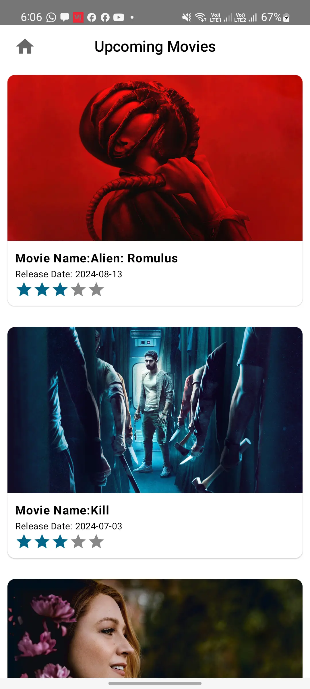

# Project - Movie Explorer

## Description

1. This Movie Explorer app displayed upcoming movies with the details
2. Used Hilt for Dependency Injection
3. Wrote Test cases for Use case, repository and viewModel
4. Architecture used: MVVM, MVI with clean

- **Model-View-ViewModel (MVVM)**
    - **Model**: Represents the data layer, including repositories, data sources, and business
      logic.
    - **View**: UI layer represented by Jetpack Compose
    - **ViewModel**: Manages UI-related data and handles business logic to interact with the model.
    - **Clean Architecture**
        - **Domain Layer**: Contains business logic and entity models.
        - **Data Layer**: Manages data sources.
        - **Presentation Layer**: Manages UI components and view models.

## Screenshots

Demonstration of the app is attached in the folder named screenshots. You can find them in
the [screenshots](screenShots) directory.

Screen shots:

